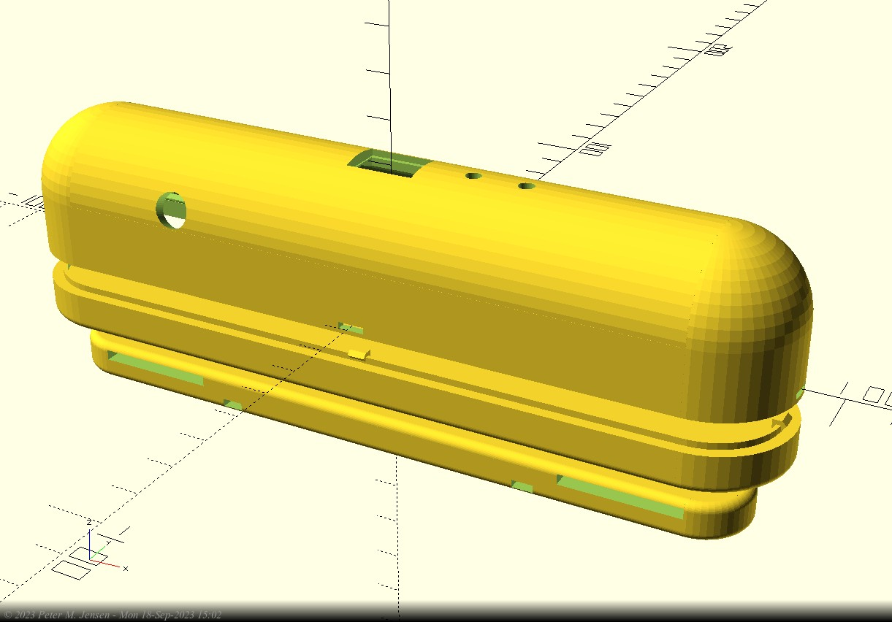
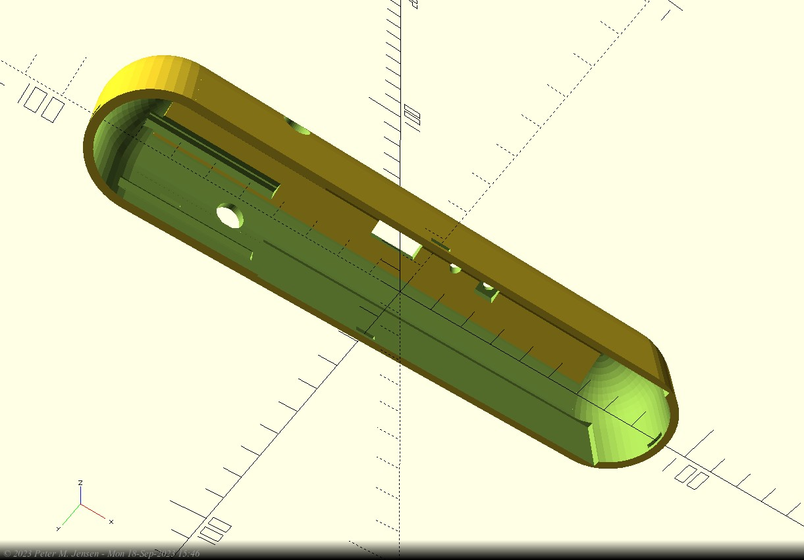
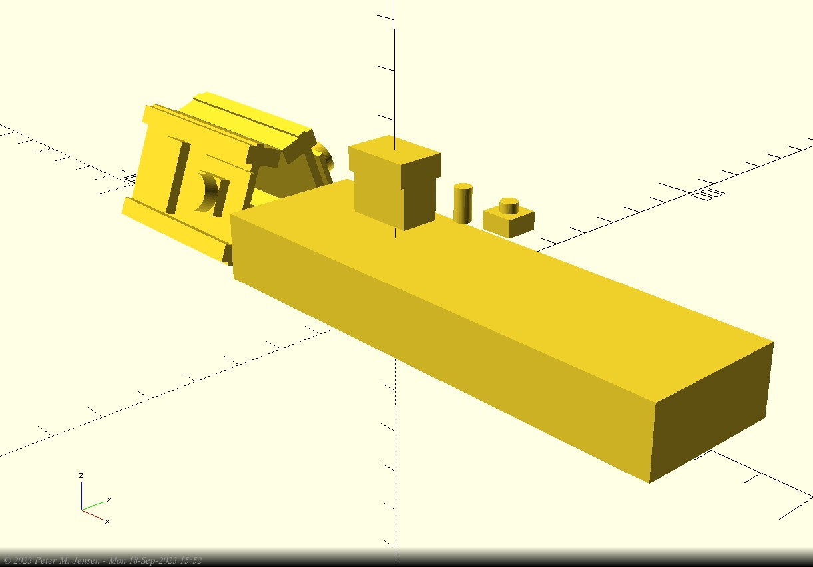
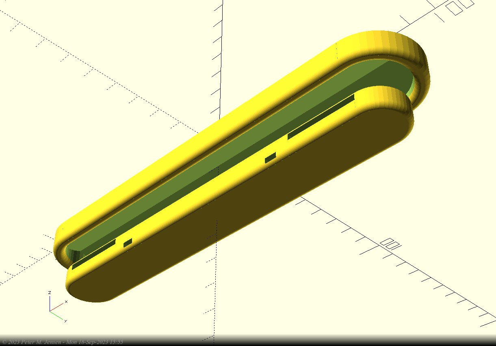
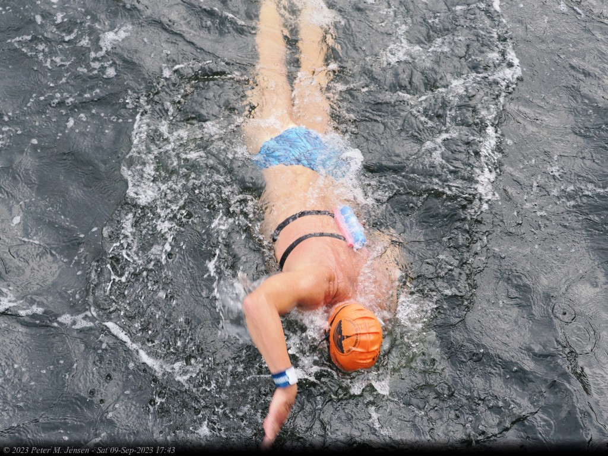
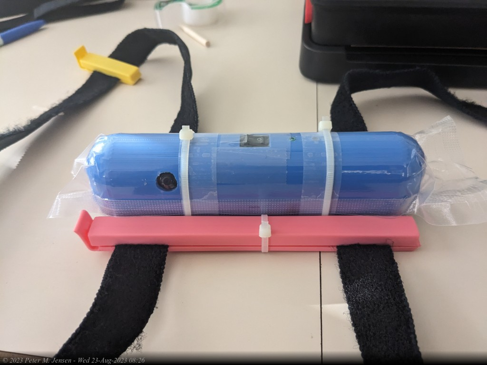
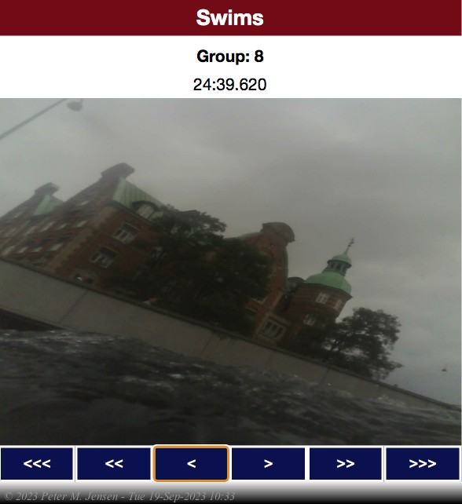

# Swim Cam

I signed up for the [Copenhagen Open Water swim](https://copenhagenswim.com/en/) around the parliament building (Christiansborg) this year (2023), and thought it would be cool to have some image/video footage from the swimmer's POV. I was also looking for a project, so two birds with one stone. It would be much simpler to use an Insta360 or GoPro with a custom mount of some sort, but that would rob me of the chance to design a system from the ground up and write a bunch of software.

## Requirements

* 1 or 2 cameras
* Simple user interface
* Waterproof enclosure (obviously)
* Access to the recorded images/videos via WiFi Access Point
* Body mount shouldn't interfere with swim stroke/speed

I picked the ESP32-CAM as the processor/camera combo. It is inexpensive (~$6) and has no availability issues. I had worked with this board before, so there would be no gotchas. The trade-off would be a less than stellar image quality.

## User Interface

The device needs three modes; a recording mode, a WiFi access mode, and an 'idle' mode. The 'idle' mode allows for cleanly finishing writes to the SDcard, to avoid corrupting it's contents, if the power is turned off in the middle of a write operation.

The solution, I settled on, uses:
1. On/Off power switch
2. Push button
3. Led to indicate current mode

After turning on the device, it will wait 10 seconds. If the user pushes the button within those 10 seconds it will go into WiFi access mode and act as a web-server. If the user does nothing it will start recording images and saving them to the SD card.  This continues until the user pushes the button again, which brings the device into 'idle' mode. It is now safe to turn off the power switch.

The LED will indicate the mode as follows:
* **Steady On**: Power is on, waiting 10 seconds for button push
* **Slow Blink Rate**: Device is taking pictures
* **Fast Blink Rate**: Device is in WiFi hotspot mode
* **Steady Off**: Device is idle and can safely be turned off.

## Enclosure

The device should be streamlined and low profile.  I had decided to use 4x AA batteries for power, so the majority of the device volume would be taken up by batteries. It's convenient to use a widely available standard size. You can get AAs anywhere. It turned out that the device can run ~16 hours on 4 rechargeables.  Much longer on regular alkalines, I'm sure.

|||
|-|-|
|||
|||

The enclosure consists of three separate pieces. The top part contains all the guts, the middle part is a lid for the top part. These two parts are sealed within a plastic vacuum bag.  The bottom part holds the straps and are zip tied to the top two parts. The bottom part with the straps are outside the sealed compartment.

The inside of the top part has space for two ESP32-CAM boards, and two 2xAA battery packs.

The bottom left picture shows the guts that goes inside the top part. The two slanted things to the left are two ESP32-CAM boards, the long square box is the two 2xAA battery holders. I find it useful to model the inside as well as the enclosure, so a simple difference() operation can be used to make the holes and groves in the actual enclosure. It also helps when determining the dimensions of the enclosure itself.

I used openScad for the design of the enclosure. openScad uses a scripting language, of sorts, to specify your objects. It's not much different than writing software in a regular programming language, so pretty easy to learn for a software person.

The actual device looks like this:

|||
|-|-|
|||

The pink clips on each side are freezer bag clips. They prevent the device from sliding around.  During the 45min swim it stayed in place. The straps are velcro straps.

## ESP32-CAM

This little marvel costs about $6. For that you get:
* ESP32 MCU
* 4M PSRAM (Pseudo Static RAM). Used for frame buffers
* 2M pixel camera
* SD card slot

There's a few drawbacks though. Primarily:
* Lack of extra GPIO pins
* Processing power of the ESP32 is limiting the frame rates and sizes
* The quality of the images is less than what I would've liked
* No on-board USB/Serial chip, so an external FTD 232 device is needed. Not a big deal, and having fewer chips on the board means that less power is consumed

## Software

There are three categories of software:
* **Device**: C++ Code running on the ESP32
* **Web App**: HTML/JS single page app (SPA) for showing the images recorded on the SD card
* **Scripts for Post Processing**: A collection of Web apps and PHP scripts for extracting the good images, and presenting them as a web page

### Device Software

I used the awesome PlatformIO VS Code plugin to write this code. The project resides in the **swim-cam/** sub directory.

Images are stored on the SD card as follows:

> `GGGG/SSSS/TTTTTTTT.jpg`

**GGGG**: A 4 digit group number. Each time the device is turned on and brought into recording mode (after 10 seconds), a new group directory is created. The groups are created in sequence, i.e. 0000, 0001, 0002, etc. The highest group number holds the most recent recording.

**SSSS**: A 4 digit sub-group number. Each subgroup will hold a maximum of 100 files. The subgroups are there to prevent directories with thousands of files, since that seems to slow down access to the SD card.

**TTTTTTTT**: An 8 digit timestamp, indicating how many milli seconds have transpired since the device started recording.

### Web App Software

When the device is in WiFi hotspot mode it serves up a single page web app (SPA). The initial screen shows the available groups stored on the SD card. The last recording appears first.  After clicking on a group the images in that group can be traversed with the buttons below the image.

After connecting to the WiFi Hotspot for the camera (SWIM-CAM1), point the browser to:

> `http://192.168.4.1/`

* **>** and **<**: forward and backward one image
* **>>** and **<<**: forward and backward ten images
* **>>>** and **<<<**: forward and backward a hundred images

Here's example screenshots of the two UI screen:
|||
|-|-|
|||

### Scripts for Post Processing

## Actual Images from Copenhagen Swim 2023

## Post Mortem

### The Good Parts

* The enclosure didn't leak. The freezer bag vacuum packing worked like a charm
* The mounting on my back was not annoying or intrusive. I hardly noticed it. Other people did though, and it turned out to be a great conversation starter.
* User Interface and Software worked as intended. Accessing the recorded images via WiFi took a long time to initially load, when there are tens of thousands of images to show. Some re-design is needed. I had only tested it on smaller groups of images.

### The Bad Parts

* #1 issue was that very few of the in-water images had contents besides blurry images of water on them. During the 75 min of recording ~16,000 images were recorded, but only about 100 of them had contents worth looking at.
* A lot of the images weren't in focus.
* The ESP32 is only able to process (save as jpeg) about 3 full size images (1600x1200) per second. The writes to the SD card could be sped up slightly by using a 4 bit bus instead of a 1 bit one. Unfortunately, that means that there aren't enough GPIO pins available for the button and LED.

## Next Version

If I were to make a next version, I would consider:
* A better camera. Maybe the one that comes with the RaspberryPi, which is 5MP (8MP for the new one) vs. the 2MP used by the ESP32-CAM
* A more powerful CPU/Microcontroller. Probably a Raspberry Pi Pico W.
* A smaller battery. This would also make the device volume smaller. Maybe a standard 9V rechargeable instead of 4xAA.

